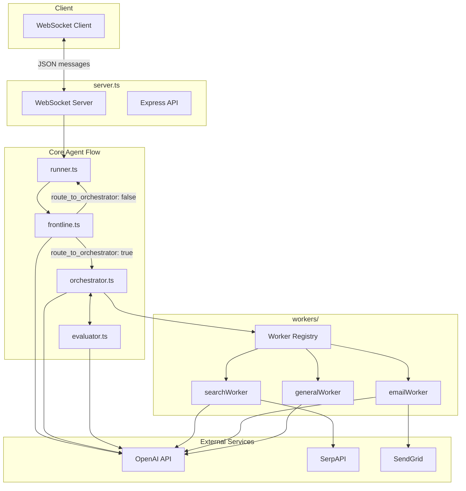
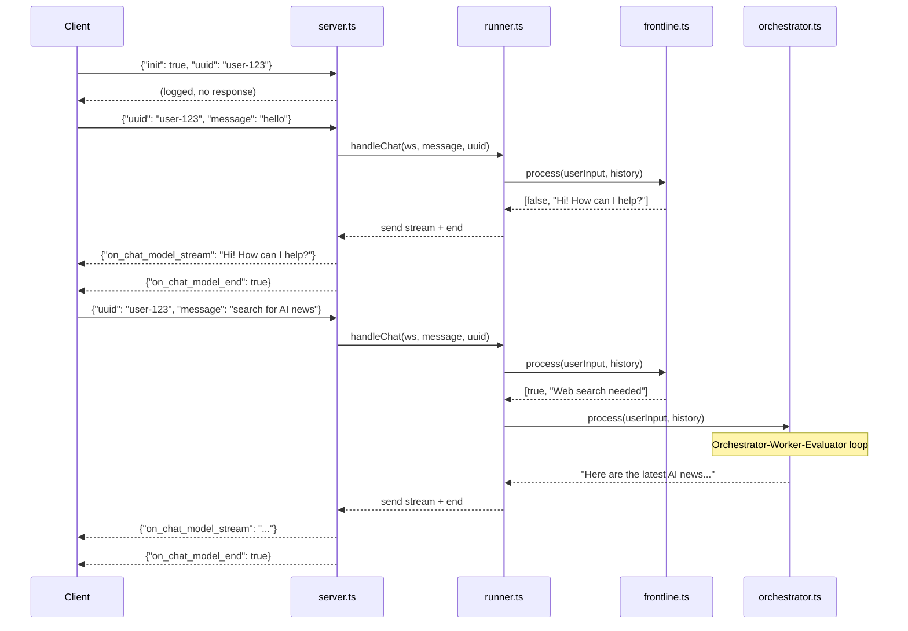
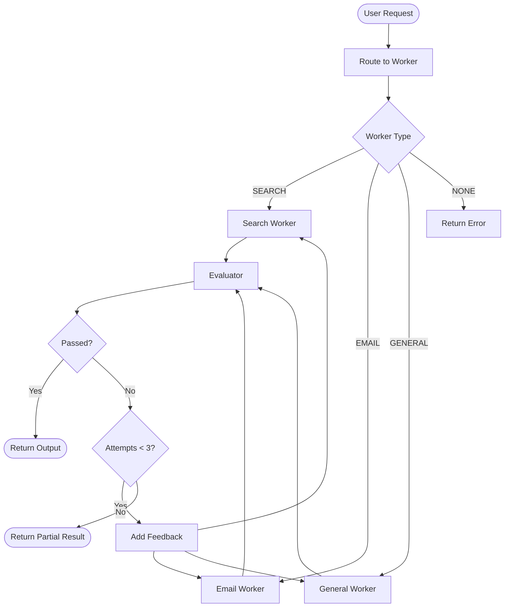
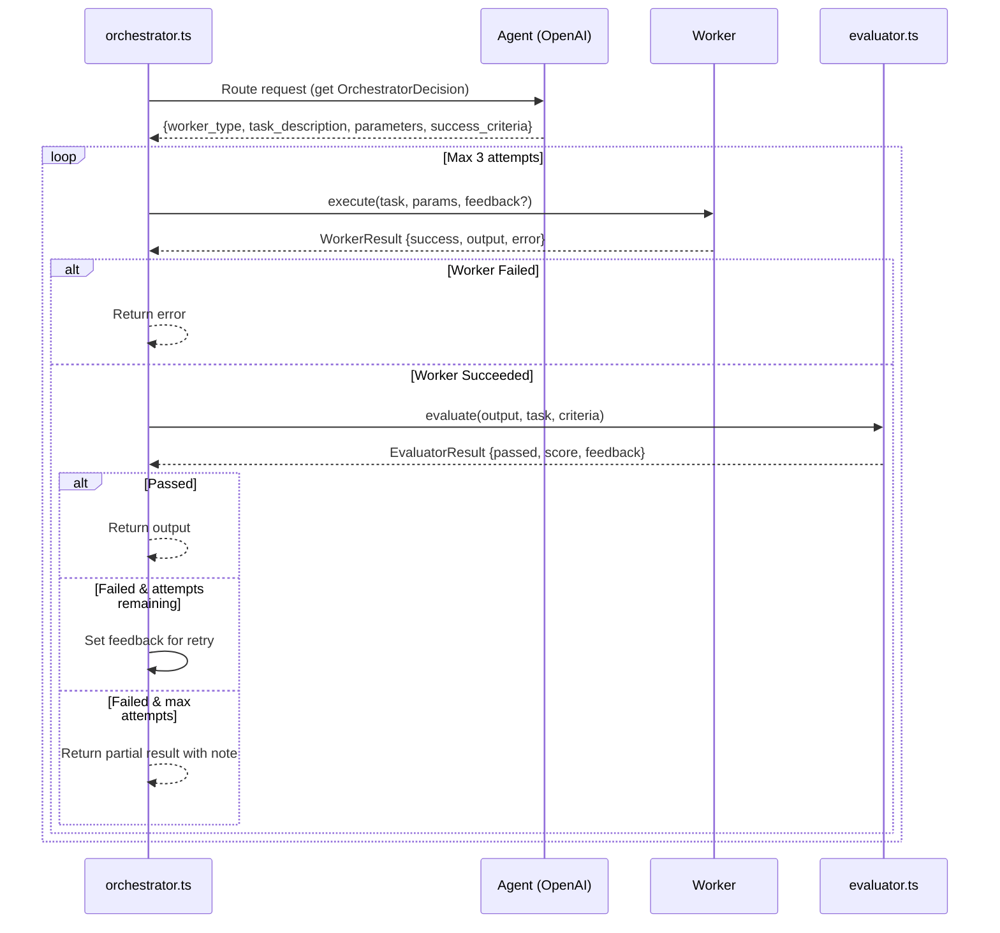
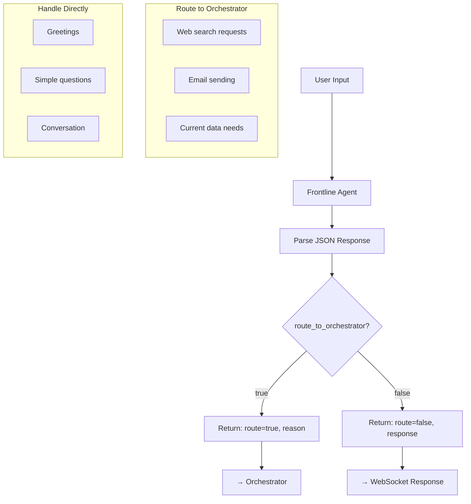
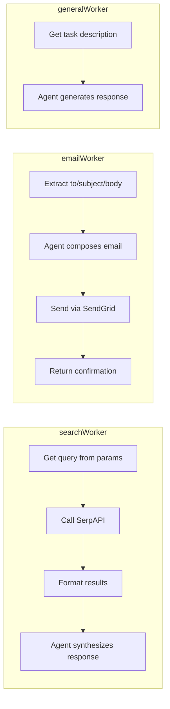
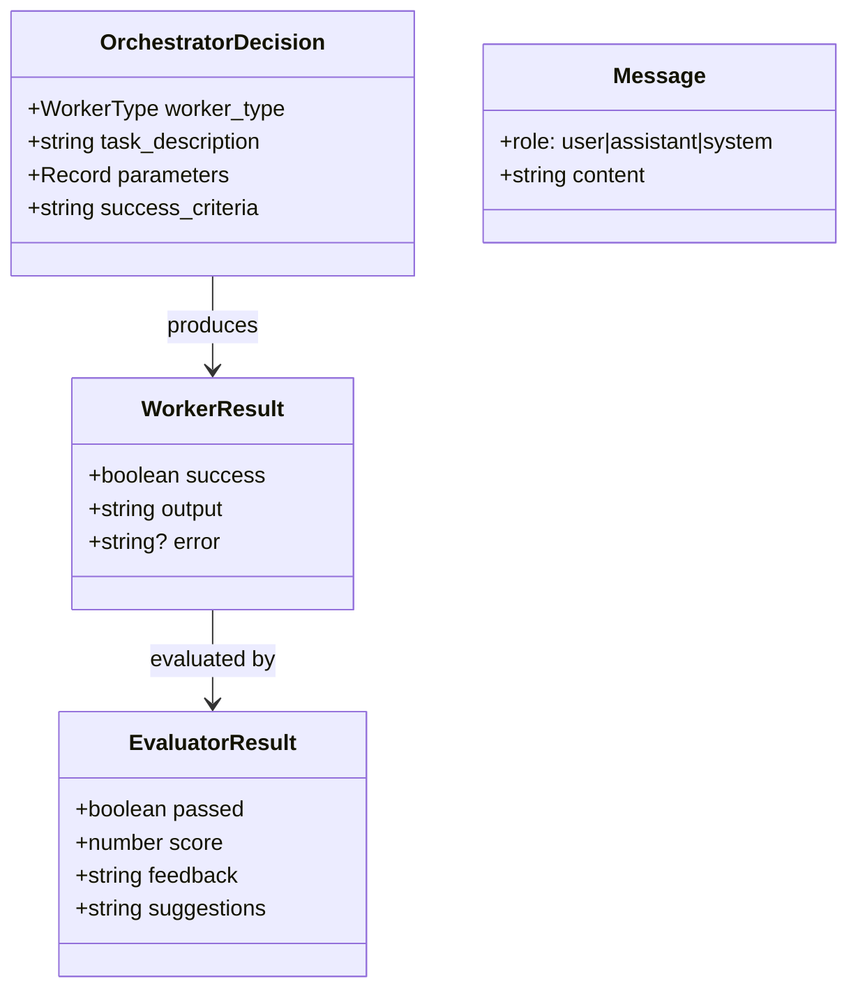
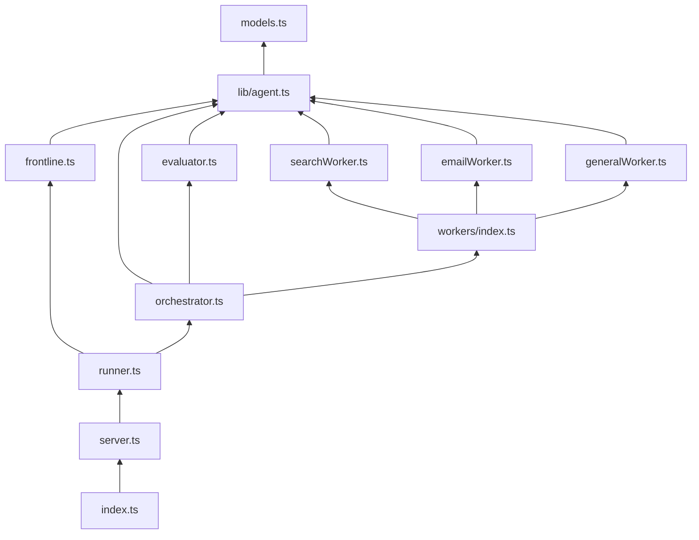

# Agent Control Flow

## High-Level Architecture

## WebSocket Message Flow

## Orchestrator-Worker-Evaluator Loop

## Detailed Orchestrator Flow

## Frontline Decision Flow

## Worker Implementations

## Data Models

## File Dependencies

