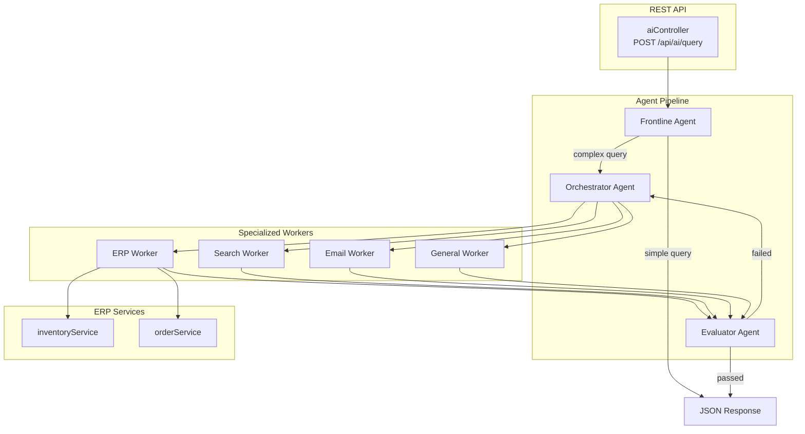
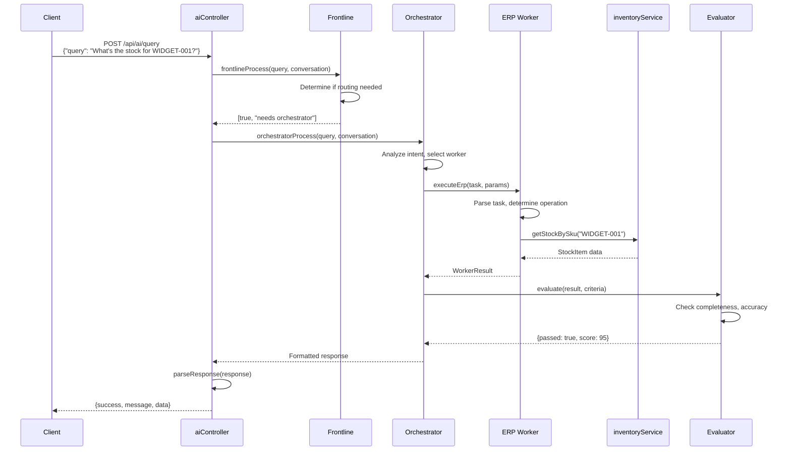
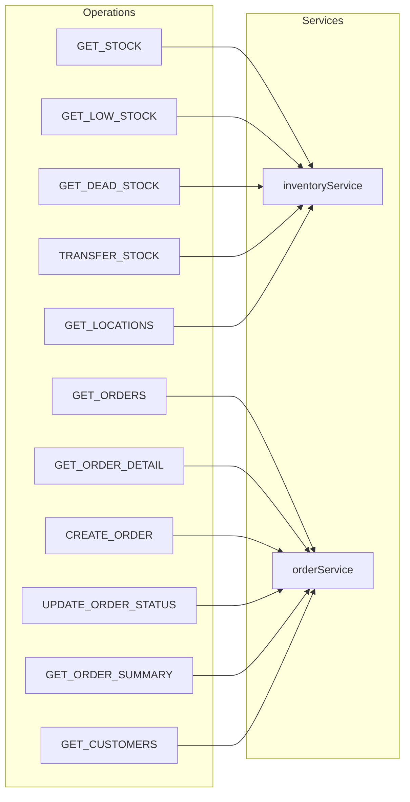

# AI Architecture

## Overview

The AI endpoint allows natural language queries to interact with the ERP system through an agent pipeline.

## Control Flow Diagram



## Request Flow



## ERP Worker Operations



## Response Format

```mermaid
flowchart TD
    subgraph Input
        RAW[Raw Agent Response<br/>"Explanation...\n\nResult:\n{json}"]
    end

    subgraph Processing
        PARSE[parseResponse]
    end

    subgraph Output
        MSG[message: string]
        DATA[data: object]
    end

    RAW --> PARSE
    PARSE --> MSG
    PARSE --> DATA
```

## API Endpoint

| Method | Endpoint | Description |
|--------|----------|-------------|
| POST | `/api/ai/query` | Process natural language query |
| DELETE | `/api/ai/session/:id` | Clear session history |

### Request Body

```json
{
  "query": "What items are below reorder point?",
  "session_id": "optional-session-id"
}
```

### Response Body

```json
{
  "success": true,
  "message": "Fetching items below their reorder threshold",
  "data": [
    {
      "sku": "WIDGET-001",
      "location": "WH-WEST",
      "qty_on_hand": 30,
      "reorder_point": 50
    }
  ],
  "session_id": "demo-session",
  "routed_to_orchestrator": true
}
```

## File Structure

```
src/
├── mocks/controllers/
│   └── aiController.ts        → POST /api/ai/query, DELETE /api/ai/session
├── frontline.ts               → Initial routing decision
├── orchestrator.ts            → Worker selection and coordination
├── evaluator.ts               → Output validation
├── workers/
│   ├── index.ts               → Worker registry
│   ├── erpWorker.ts           → ERP operations (imports services directly)
│   ├── searchWorker.ts        → Web search
│   ├── emailWorker.ts         → Email composition
│   └── generalWorker.ts       → General conversation
└── prompts/
    ├── frontline.ts           → Frontline system prompt
    ├── orchestrator.ts        → Orchestrator system prompt
    ├── evaluator.ts           → Evaluator system prompt
    └── workers/
        └── erp.ts             → ERP worker system prompt
```
