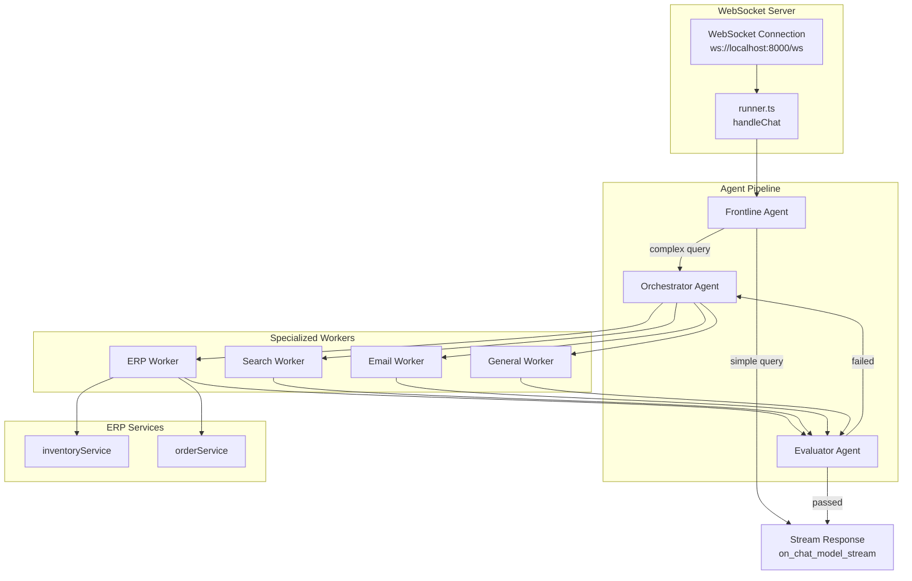
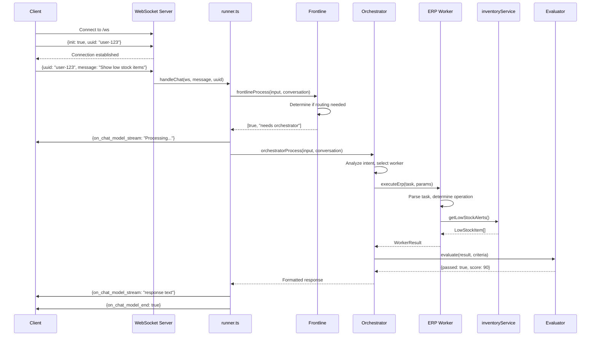
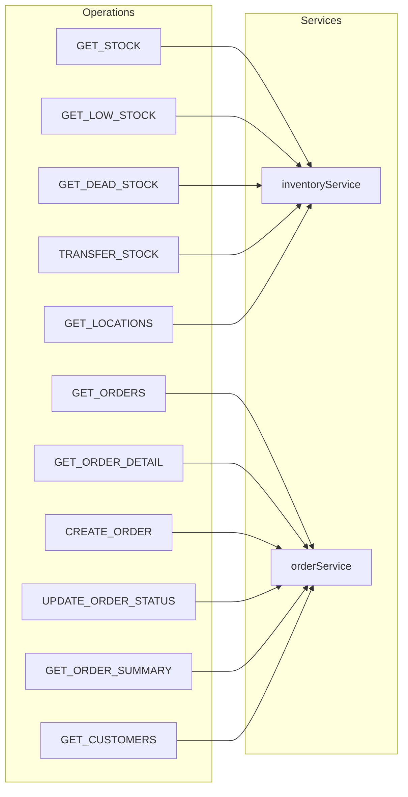

# Chat AI Architecture

## Overview

The WebSocket chat interface allows real-time conversational interaction with the ERP system through an agent pipeline.

## Control Flow Diagram



## WebSocket Message Flow



## Conversation Management

```mermaid
flowchart TD
    subgraph Sessions["Conversation Sessions"]
        MAP[conversations Map<br/>uuid → Message[]]
    end

    subgraph Message["Message Structure"]
        ROLE[role: user/assistant]
        CONTENT[content: string]
    end

    subgraph Flow["Conversation Flow"]
        IN[User message in]
        PUSH1[Push to history]
        PROCESS[Process through agents]
        PUSH2[Push response to history]
        OUT[Stream response out]
    end

    IN --> PUSH1
    PUSH1 --> MAP
    MAP --> PROCESS
    PROCESS --> PUSH2
    PUSH2 --> MAP
    PUSH2 --> OUT
```

## ERP Worker Operations



## WebSocket Protocol

### Connection

```
ws://localhost:8000/ws
```

### Initialize Session

```json
{
  "init": true,
  "uuid": "user-123"
}
```

### Send Message

```json
{
  "uuid": "user-123",
  "message": "What's the stock for WIDGET-001?"
}
```

### Receive Stream

```json
{"on_chat_model_stream": "Processing your request..."}
{"on_chat_model_stream": "\n\n"}
{"on_chat_model_stream": "Looking up stock levels...\n\nResult:\n{...}"}
{"on_chat_model_end": true}
```

## File Structure

```
src/
├── server.ts                  → Express + WebSocket server setup
├── runner.ts                  → handleChat, conversation management
├── frontline.ts               → Initial routing decision
├── orchestrator.ts            → Worker selection and coordination
├── evaluator.ts               → Output validation
├── workers/
│   ├── index.ts               → Worker registry
│   ├── erpWorker.ts           → ERP operations (imports services directly)
│   ├── searchWorker.ts        → Web search
│   ├── emailWorker.ts         → Email composition
│   └── generalWorker.ts       → General conversation
└── prompts/
    ├── frontline.ts           → Frontline system prompt
    ├── orchestrator.ts        → Orchestrator system prompt
    ├── evaluator.ts           → Evaluator system prompt
    └── workers/
        └── erp.ts             → ERP worker system prompt
```

## Comparison: Chat vs REST

| Feature | Chat (WebSocket) | REST API |
|---------|------------------|----------|
| Entry Point | `ws://localhost:8000/ws` | `POST /api/ai/query` |
| Handler | `runner.ts` → `handleChat` | `aiController.ts` |
| Response | Streaming (`on_chat_model_stream`) | JSON (`{message, data}`) |
| Session | `conversations` Map by UUID | `sessions` Map by session_id |
| Use Case | Interactive chatbot UI | Programmatic API integration |
