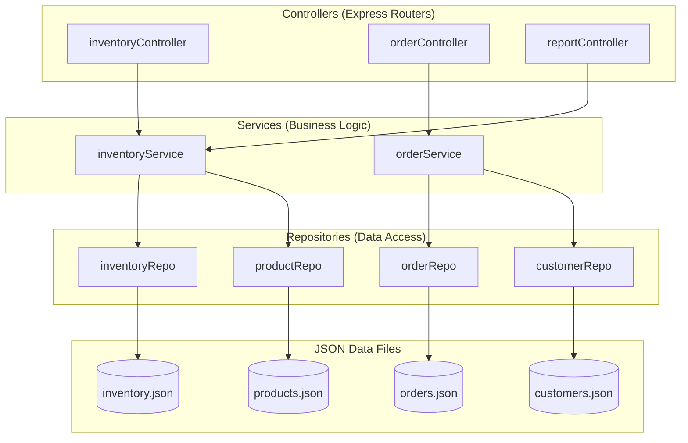
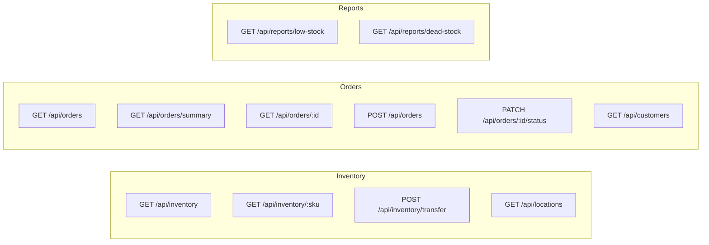
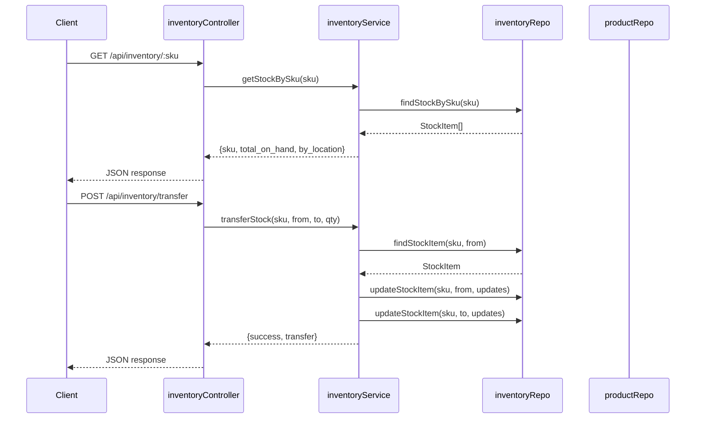
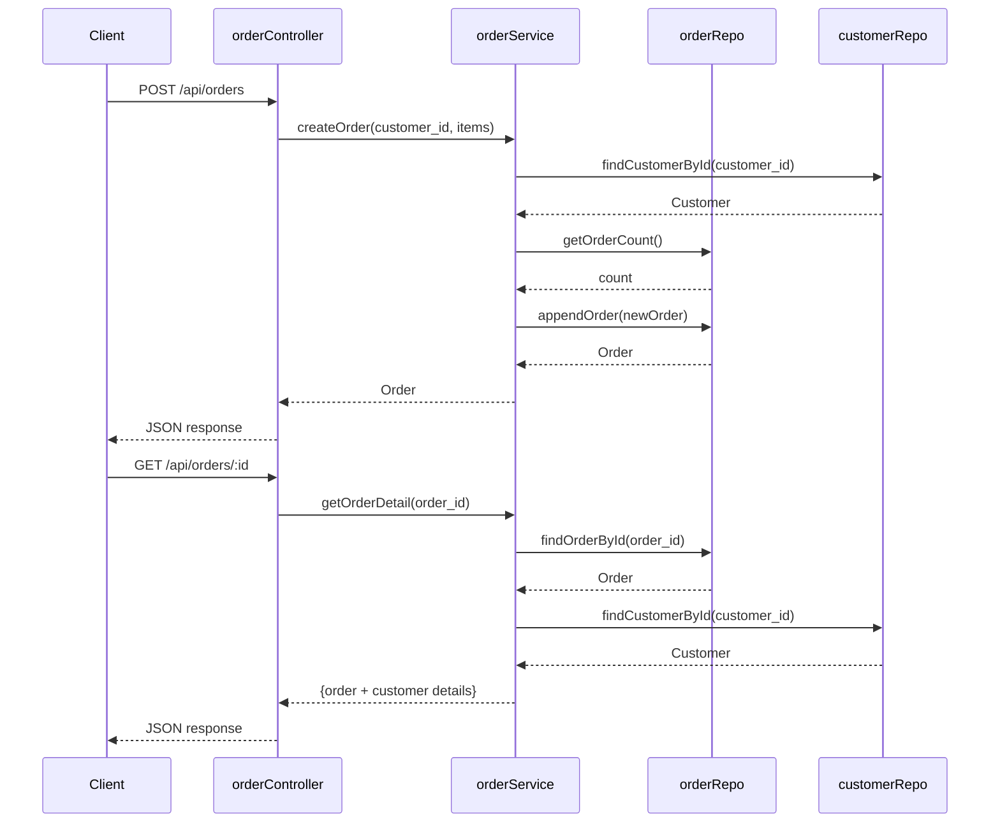

# Mocks Architecture

## Control Flow Diagram



## API Endpoints



## Inventory Flow Detail



## Order Flow Detail



## File Structure

```
src/mocks/
├── data/
│   ├── customers.json
│   ├── inventory.json
│   ├── orders.json
│   └── products.json
├── controllers/
│   ├── inventoryController.ts  → /api/inventory, /api/locations
│   ├── orderController.ts      → /api/orders, /api/customers
│   └── reportController.ts     → /api/reports
├── services/
│   ├── inventoryService.ts     → stock operations, transfers, alerts
│   └── orderService.ts         → order CRUD, customer lookup
└── repositories/
    ├── customerRepo.ts         → Customer data access
    ├── inventoryRepo.ts        → Stock & Location data access
    ├── orderRepo.ts            → Order data access
    └── productRepo.ts          → Product data access
```
